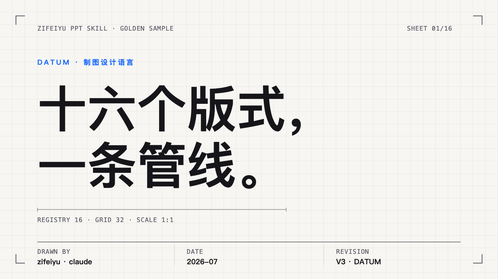
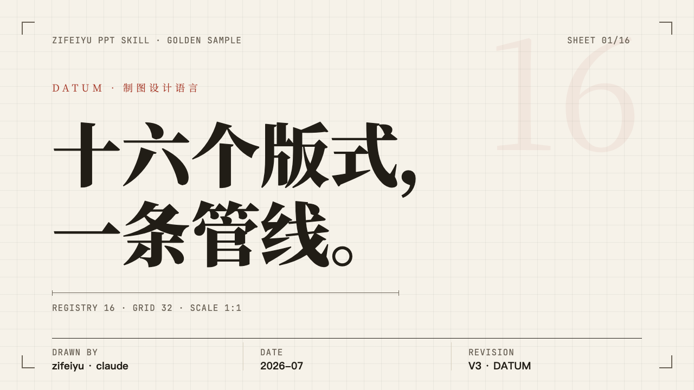
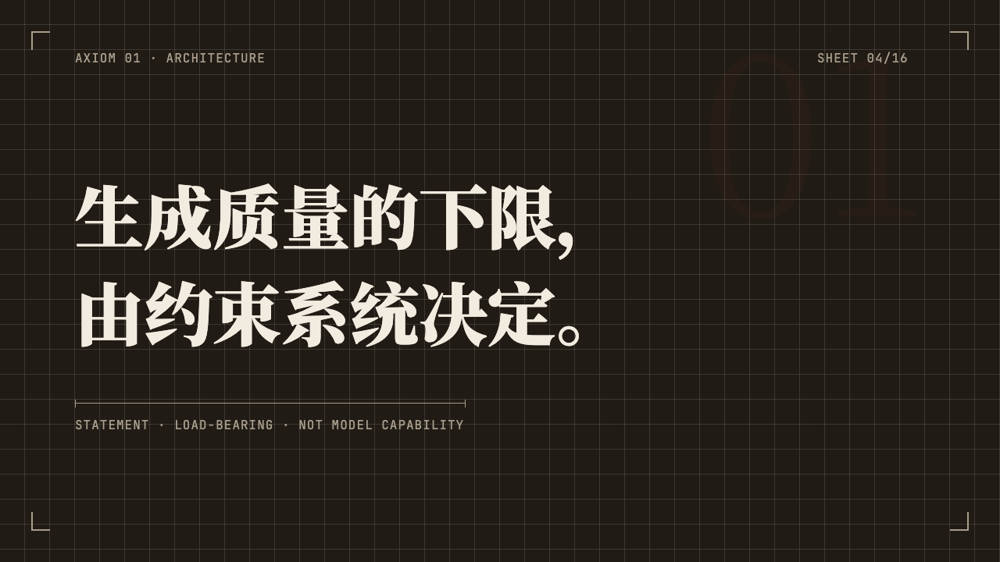

# zifeiyu-ppt-skill

> Design-locked HTML slide decks with **deterministic export to editable PPTX** — an agent skill for Claude Code and other file-capable coding agents.
>
> [中文文档](README.md)

The one-line difference from similar projects: beautiful HTML decks usually can't become .pptx files, and generic HTML→PPTX translators are too fragile. This skill gets both through **registered layouts + deterministic mapping**: every slide must declare a layout ID from a closed set, so the exporter only ever faces known structures — coordinates convert at a fixed ratio, results are predictable and regression-testable.



## Features

- **24 registered layouts × 3 design systems × 3 token themes** — cover, agenda, section, statement, comparison, KPI, bar chart, spec table, timeline (horizontal & vertical), image hero/grid (mirrorable), ledger, matrix inventory, process, closed loop, concentric system, video hero, inset video, audio track, closing; swap the entire type language by changing one CSS file: modern sans with DATUM drafting chrome, serif editorial, or Swiss International GRID (calibrated greys × one Klein-blue anchor × the-bigger-the-lighter display type × mutually-exclusive color fields × color loop)
- **Video & audio as first-class citizens** — `<video>/<audio>` join the element contract: posters lock the still frame for deterministic rendering, the presentation layer drives playback (auto-muted heroes, click-to-play, a designed audio card), PPTX embeds media natively (double-click to play), PDF substitutes poster frames
- **Deterministic font subsets** — Source Han Sans (variable weight), Source Han Serif, and JetBrains Mono are sliced to each deck's actual characters (~800KB per deck) and travel with it: identical rendering on macOS/Windows/Linux, works on file://; CJK refinements (halt punctuation compression, balanced line wrapping, justified body columns) built in
- **Four-format delivery chain** — HTML presentation → editable PPTX → vector PDF → per-slide PNG, each one command; HTML is the single source of truth
- **Machine quality gate** — a Playwright validator enforces R1–R15 quantified rules (layout registry, class whitelist, overflow with graduated fix advice, font floor, text collision, bar-chart proportionality, contrast floor, document hygiene, media contract, placeholder text…); a separate OOXML artifact gate (`check-pptx`) checks package integrity, relationships, and chart XML after export; golden-deck pixel baselines guard every skeleton/theme change (`npm run regress`)
- **Poster-grade typography** — 100px cover titles, 220px section numerals, 136px thin-weight KPI figures, 280px translucent ghost type, per-slide dark inversion
- **Semantic animations** — count-up numbers, popping dots, drawing rules; bound to element semantics, presentation-only, exports never affected
- **Presenter console** — press `S` for a dual-window console (current + next preview, timer, speaker notes), synced via BroadcastChannel, works on `file://`
- **Data honesty protocol** — KPI/chart layouts require real, sourced values (validator-enforced), and L15 bar lengths are machine-checked to stay proportional to their stated numbers; no data, no numbers
- **Editable down to the word** — inline emphasis exports as native PPTX text runs; designed-contiguous slot groups merge into single textboxes with per-paragraph styling and exact spacing; experimental `--embed-fonts` rides font subsets inside the .pptx
- **Post-delivery tweaks** — open `index.html?edit=1` to edit text in place (layout locked) and download the result; extract a brand theme from any corporate template in one command (`import-theme`, with a contrast report)

| | |
|---|---|
|  |  |

## Install

```bash
npx skills add https://github.com/ye4wzp/zifeiyu-ppt-skill --skill zifeiyu-ppt-skill
# or
git clone https://github.com/ye4wzp/zifeiyu-ppt-skill ~/.claude/skills/zifeiyu-ppt-skill
cd ~/.claude/skills/zifeiyu-ppt-skill && npm install
```

Requires Node.js ≥ 18 and `npx playwright install chromium-headless-shell`. Fetch the source fonts once with `node scripts/fetch-fonts.mjs` (~80MB, all SIL OFL; skipping it falls back to system fonts). LibreOffice + poppler are optional (PPTX-side geometry verification).

## Usage

Ask Claude Code to "make a deck about X" — the skill drives an 8-step workflow: clarify & pick tier → verify facts → scaffold → 2-slide sample gate → batch production → machine validation → visual check → export.

```bash
node scripts/new-deck.mjs <deck-dir> --theme paper   # scaffold a self-contained deck
node scripts/subset-fonts.mjs <deck-dir>             # deck-local webfont subsets (re-run after text edits)
node scripts/validate.mjs <deck-dir> [--office]      # machine gate R1–R15
node scripts/render-png.mjs <deck-dir>
node scripts/export-pdf.mjs <deck-dir>
node scripts/export-pptx.mjs <deck-dir> --cjk-font "Microsoft YaHei"
npm run regress                                      # pixel regression vs golden baselines
```

Presentation keys: arrows to navigate · `F` fullscreen · `S` presenter console.

## Known limits

- PPTX cannot embed fonts (pptxgenjs limitation); declared faces must exist on the viewer's machine ("Microsoft YaHei" / "SimSun" defaults are Windows-safe)
- Not intended for large data tables or collaborative editing

## Credits

Methodology inspired by (independently implemented, no code reused):
[guizang-ppt-skill](https://github.com/op7418/guizang-ppt-skill) ·
[huashu-design](https://github.com/alchaincyf/huashu-design) ·
[html-ppt-skill](https://github.com/lewislulu/html-ppt-skill) ·
[guizang-social-card-skill](https://github.com/op7418/guizang-social-card-skill)

## License

[MIT](LICENSE)
