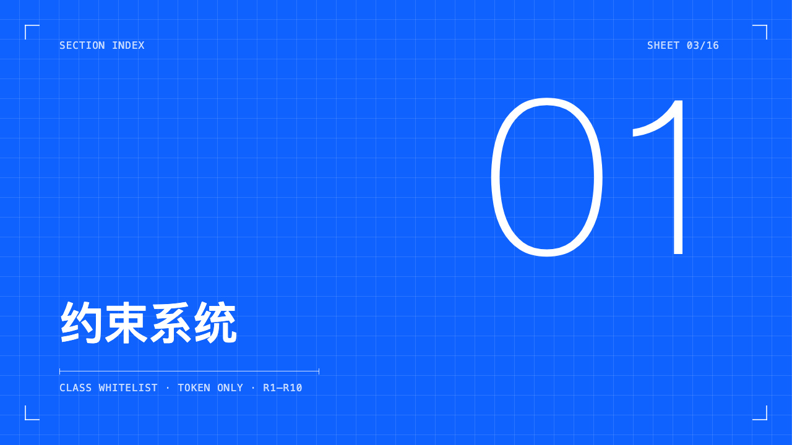
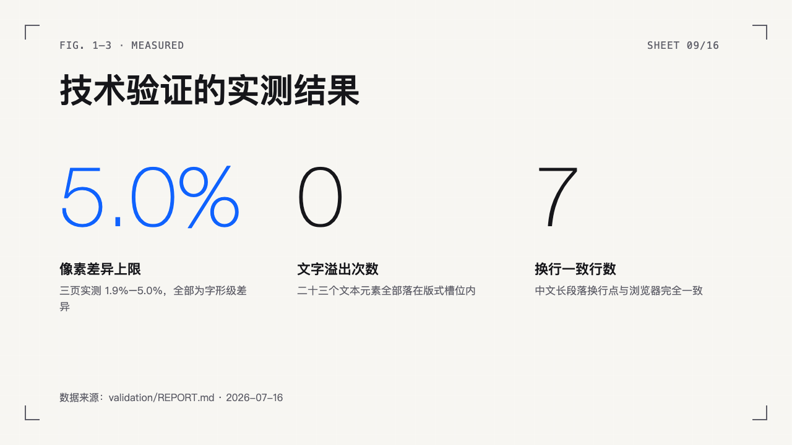
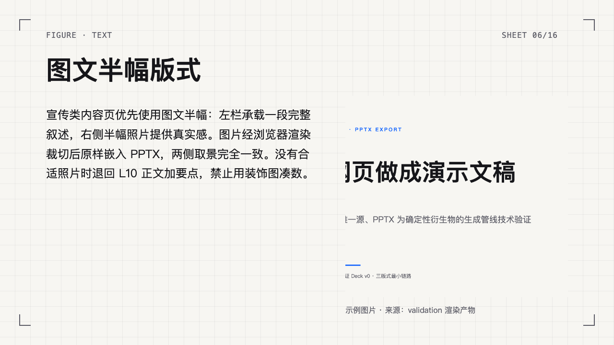
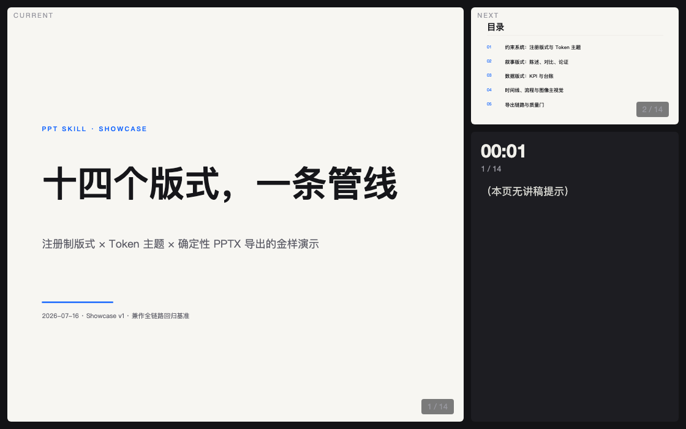

# zifeiyu-ppt-skill

> 生成锁定设计系统的网页 PPT，并**确定性导出可编辑 PPTX** 的 Agent Skill。
>
> English: [README.en.md](README.en.md)
>
> An agent skill that generates design-locked HTML slide decks and deterministically exports them to editable PPTX. Works with Claude Code and other file-capable coding agents.

一句话说清楚它和同类项目的区别：**别人的网页 PPT 很美但导不出 .pptx，通用 HTML→PPTX 翻译又太脆——这里用"注册制版式 + 确定性映射"同时拿到两者**：每页必须声明封闭集合内的版式编号，导出器只面对已知结构，坐标按固定比例换算，结果可预期、可回归测试。


## 特性

- **16 个注册版式 × 2 套设计系统 × 3 套 Token 主题**：版式覆盖封面、目录、章节、金句、对比、论证、KPI、条形图、时间线、图文、图片网格、台账、流程、全幅图、结尾，另有页码/logo/二维码企业槽位；设计系统有现代无衬线与「墨韵」衬线杂志风（宋体 × 暖纸 × 朱砂）两套——同一版式库，换一个 CSS 文件整套切换
- **四格式交付链**：HTML 演示 → 可编辑 PPTX → 矢量 PDF → 逐页 PNG，全部一条命令，HTML 是唯一的源
- **机器质量门**：Playwright 校验器执行 R1–R10 量化规则（版式注册、类名白名单、溢出、字号下限、文本碰撞、密度带……），错误即阻断交付
- **DATUM 制图美学**：坐标纸纹理、四角角线、尺寸标注线、工程图签栏、SHEET 页码、等宽技术标注——设计语言与"确定性导出"的产品灵魂同源；128px 大字排印、满幅色场、单页明暗节奏
- **语义动画**：数字 count-up、圆点弹入、分隔线拉出——与元素语义绑定，演示模式自动生效，导出通道零影响
- **演讲者模式**：`S` 键开双窗控制台（当前页 + 下页预览 + 计时器 + 讲稿提示），BroadcastChannel 同步，`file://` 直接可用
- **数据诚实协议**：KPI 版式强制真实数据与来源脚注，查不到就换概念版式，禁止编造

| | | |
|---|---|---|
|  |  |  |

同一份内容，一行切换「墨韵」衬线系统：

| | |
|---|---|
|  |  |

## 安装

```bash
# 方式一：skills CLI
npx skills add https://github.com/ye4wzp/zifeiyu-ppt-skill --skill zifeiyu-ppt-skill

# 方式二：手动
git clone https://github.com/ye4wzp/zifeiyu-ppt-skill ~/.claude/skills/zifeiyu-ppt-skill
cd ~/.claude/skills/zifeiyu-ppt-skill && npm install
```

依赖：Node.js ≥ 18；首次使用 Playwright 需 `npx playwright install chromium-headless-shell`（国内网络可加 `PLAYWRIGHT_DOWNLOAD_HOST=https://cdn.npmmirror.com/binaries/playwright`）。PPTX 侧几何验证可选装 LibreOffice + poppler。

## 使用

对 Claude Code 说"做一个 XX 主题的 PPT"即可进入 8 步工作流：澄清定档 → 事实核查 → 建 deck → 样张确认 → 批量填充 → 机器校验 → 视觉自检 → 按档位导出。

手动命令：

```bash
node scripts/validate.mjs <deck-dir> [--office]              # 机器校验
node scripts/render-png.mjs <deck-dir>                       # 逐页截图
node scripts/export-pdf.mjs <deck-dir>                       # 矢量 PDF（960×540pt）
node scripts/export-pptx.mjs <deck-dir> --cjk-font "Microsoft YaHei"  # 可编辑 PPTX
```

演示快捷键：方向键翻页 · `F` 全屏 · `S` 演讲者控制台。



## 设计原则

1. **约束换质量**：LLM 生成视觉内容的质量下限由约束系统决定。禁止从零写 HTML、禁止自造类名、颜色只经 token——校验器逐条拦截。
2. **注册制映射**：`data-layout` 声明封闭版式集合，PPTX 导出是每版式一个确定性映射函数，不做任意结构的猜测；cover 图片以浏览器渲染的裁切结果原样嵌入，两侧取景逐像素一致。
3. **画布契约**：1280×720 逻辑画布，px÷96→英寸、px×0.75→磅，正好映射 PowerPoint 标准 960×540pt。
4. **三道质量门**：机器校验（exit 1 阻断）→ 渲染目检（P0–P3 分级）→ 导出比对（金样回归基线随仓库维护）。

## 已知边界

- PPTX 不嵌入字体（pptxgenjs 限制），跨平台交付默认 `Microsoft YaHei`；接收方机器需装有声明的字体
- LibreOffice 仅作几何验证（其 macOS 中文字体解析不稳定），字体保真以 WPS/PowerPoint 实开为准
- 不适合大数据表格、多人协作编辑场景

## 致谢

方法论受以下项目启发（均为独立实现，未复用其代码）：
[guizang-ppt-skill](https://github.com/op7418/guizang-ppt-skill) 的约束系统与版式注册纪律 ·
[huashu-design](https://github.com/alchaincyf/huashu-design) 的 HTML-first 交付链与样张门 ·
[html-ppt-skill](https://github.com/lewislulu/html-ppt-skill) 的 Token 主题与演讲者模式 ·
[guizang-social-card-skill](https://github.com/op7418/guizang-social-card-skill) 的量化校验思想

## License

[MIT](LICENSE)
